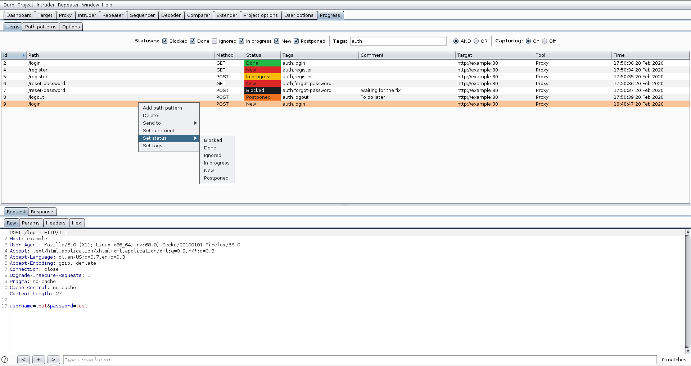

Progress
========

Burp Suite extension to track vulnerability assessment progress.

Features
--------
* Capturing items (unique requests) from the Burp Suite tools (Proxy, Repeater, Target). Request unique key is defined as follows: target (host, port, protocol), path and method.
* Items have following editable properties:
  - comment
  - status (Blocked, Done, Ignored, In progress, New, Postponed)
  - tags

* Items can be filtered by:
  - status
  - tags (there are two filtering modes: **AND** - item has to have all filtering tags **OR** - item has to have at least one of the filtering tags)
  
* Exclude requests from capture based on the path extension or response status code
* Selected items can be sent to the Burp Suite tools: Intruder, Repeater or Scanner
* Selected item is displayed in the full functional Burp Suite HTTP message editor
  
* Path patterns - unique key of the request is defined by target, path and method. However it can be usefull to define path pattern (regexp) to consider different requests as the same item (e.g. /article/\d+?/comments path pattern groups following requests: /article/1/comments, /article/2/comments, /article/100/comments, etc.)

* Optionally, items and path patterns can be persisted to keep the state between Burp Suite launches (please see [Requirements](#Requirements))

Usage
-----
* Create a new project or use existing one
* If you want to keep state between Burp Suite launches, choose a file where to store data (Progress -> Options -> Database -> Save as...)
* Now items are automatically saved/updated in the SQLite database, and state will be automatically restored after Burp Suite reopening

Options
-------
* Database - selects file to persist items and path patterns (please see [Requirements](#Requirements))
* Scope tools - enables items capturing for selected Burp Suite tools (Proxy, Repeater, Target)
* Excluded extensions - requests with these path extensions won't be processed
* Excluded status codes - responses (and related requests) with these status codes won't be processed
* Overwrite duplicate items - the current item will be replaced by the newest duplicate (state of the item is preserved)
* Process only in-scope requests
* Set *In progress* status when sending item to tool

Requirements
------------
If you install extension manually, and you want to persist items and path patterns, it is necessary to install SQLite JDBC driver.

1) Download driver from https://mvnrepository.com/artifact/org.xerial/sqlite-jdbc
2) Put downloaded driver (jar file) in the folder on the disk (e.g. /home/user/burpsuite-jars)
3) Set Burp Suite option (Extender -> Options -> Java Environment) to the path of folder with the driver
4) Reload the extension

Changes
-------
Please see the [CHANGELOG](CHANGELOG)

BApp Store
----------
Extension is available in the BApp Store: [Progress Tracker](https://portswigger.net/bappstore/17544cadcec64dcf8ed68df8518592e4)
